## Lab1 
### Modules maven : avec spring boot
- Créer un projet maven nommé commandes : projet parent.
- Le projet parent est un projet spring boot.
- Créer les modules maven suivants : services, web et start.
- Services sera un projet qui gere le metier de l'application
- Web va gerer les controller
- Start est le projet de démarrage

### Prérequis
- JDK 17
- Maven 3.*
- Docker

### LOGS
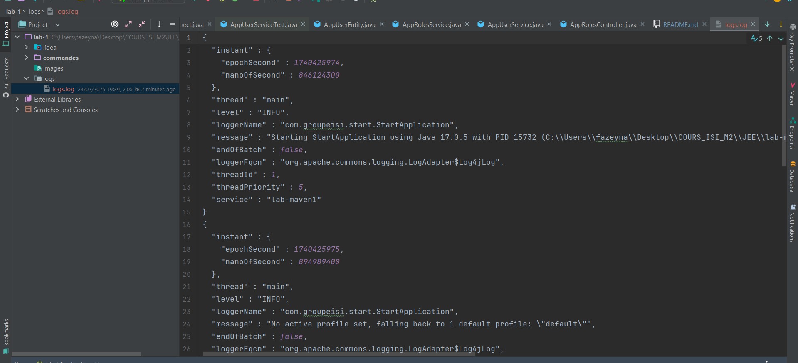
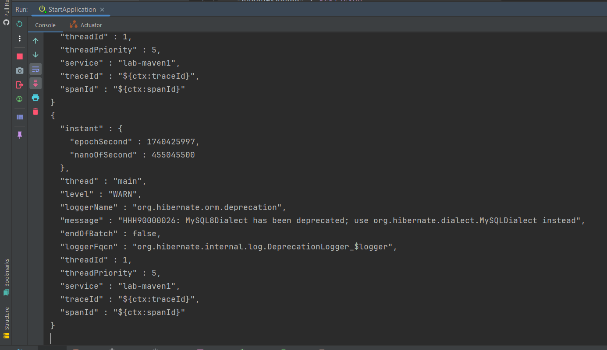

### Base de données
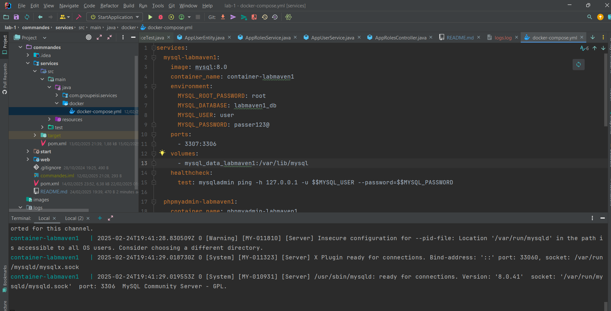
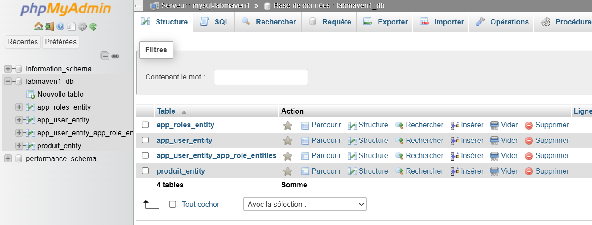
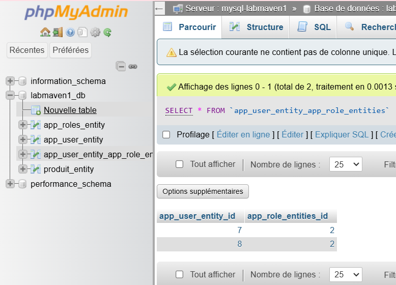

### Test de quelques endpoints
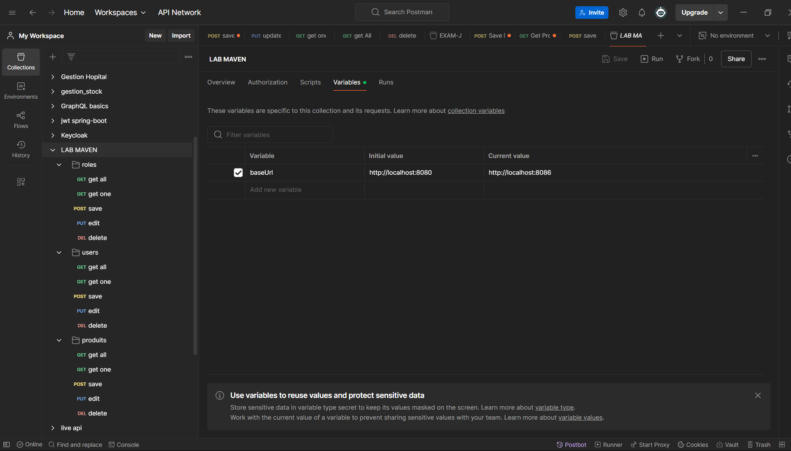
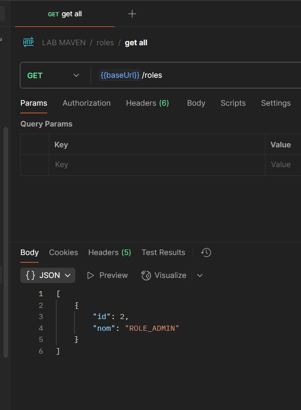
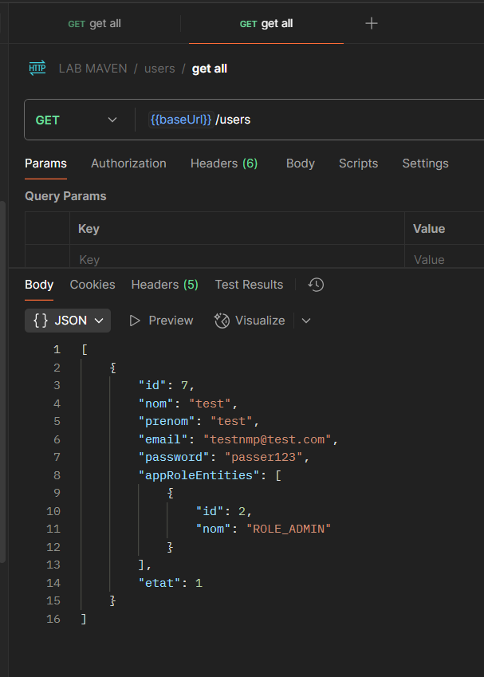
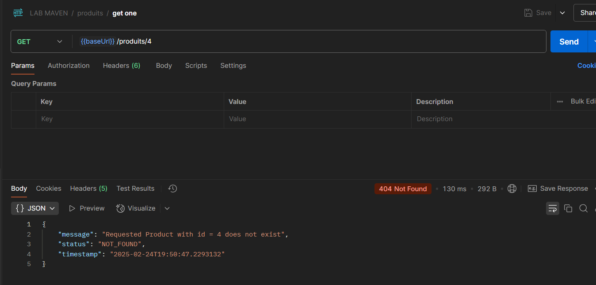
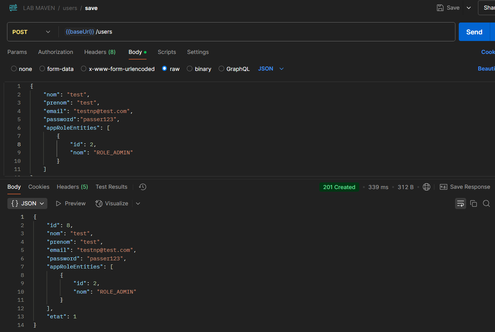
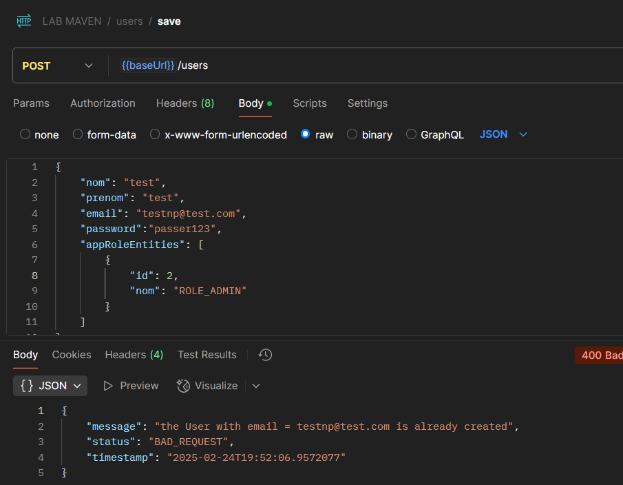